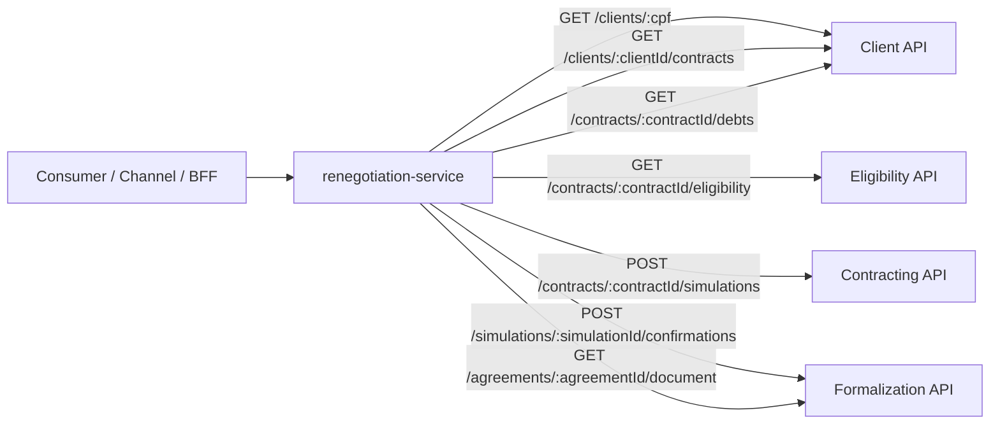

# Renegotiation Service

Serviço em .NET 8 para orquestrar a jornada de renegociação de dívidas.

Ele expõe endpoints canônicos para consulta de cliente, contratos, dívidas, elegibilidade, simulação, confirmação de acordo e documento de formalização. Internamente, delega as chamadas para APIs especializadas: Client API, Eligibility API, Contracting API e Formalization API.

## Responsabilidades

- Consultar cliente por CPF.
- Consultar contratos de um cliente.
- Consultar dívidas de um contrato.
- Verificar elegibilidade de renegociação.
- Simular uma proposta de renegociação.
- Confirmar acordo a partir de uma simulação.
- Consultar documento/link de formalização.
- Aplicar retry nas chamadas HTTP para APIs dependentes.
- Padronizar respostas e erros para consumidores upstream.

## Arquitetura



## Stack

- .NET 8 / ASP.NET Core Minimal APIs
- Swagger / OpenAPI em ambiente `Development`
- `HttpClientFactory`
- `Microsoft.Extensions.Http.Resilience`
- Logs com `TraceId`, `SpanId`, `ParentId` e `CorrelationId`

## Endpoints

### `GET /clients/{cpf}`

Consulta dados básicos do cliente por CPF.

Resposta:

```json
{
  "found": true,
  "client": {
    "cpf": "12345678900",
    "name": "Cliente Exemplo"
  }
}
```

### `GET /clients/{clientId}/contracts`

Consulta contratos associados ao cliente.

Resposta:

```json
{
  "found": true,
  "contracts": [
    {
      "contractId": "contract-001",
      "productType": "loan",
      "outstandingAmount": 1500.75
    }
  ]
}
```

### `GET /contracts/{contractId}/debts`

Consulta dívidas vinculadas ao contrato.

Resposta:

```json
{
  "found": true,
  "debts": [
    {
      "debtId": "debt-001",
      "amount": 500.25,
      "dueDate": "2026-01-10",
      "daysOverdue": 30
    }
  ]
}
```

### `GET /contracts/{contractId}/eligibility`

Verifica se o contrato é elegível para renegociação.

Resposta:

```json
{
  "eligible": true,
  "reason": null
}
```

### `POST /contracts/{contractId}/simulations`

Simula uma proposta de renegociação.

Request:

```json
{
  "installments": 12,
  "discount_percentage": 10
}
```

Resposta:

```json
{
  "possible": true,
  "reason": null,
  "simulation": {
    "simulationId": "sim-001",
    "installments": 12,
    "installmentAmount": 120.5,
    "totalAmount": 1446.0
  }
}
```

### `POST /simulations/{simulationId}/confirmations`

Confirma o acordo a partir de uma simulação.

Resposta:

```json
{
  "confirmed": true,
  "reason": null,
  "agreement": {
    "agreementId": "agr-001"
  }
}
```

### `GET /agreements/{agreementId}/document`

Consulta o documento ou link de formalização do acordo.

Resposta:

```json
{
  "available": true,
  "reason": null,
  "documentUrl": "https://example.com/document.pdf"
}
```

## Tratamento de erros

Quando uma API dependente falha após as tentativas de retry, o serviço retorna `502 Bad Gateway` com uma resposta padronizada.

Exemplo:

```json
{
  "error": "Client API unavailable"
}
```

Mapeamento atual:

| Dependência | Endpoints afetados | Erro |
|---|---|---|
| Client API | `/clients/{cpf}`, `/clients/{clientId}/contracts`, `/contracts/{contractId}/debts` | `Client API unavailable` |
| Eligibility API | `/contracts/{contractId}/eligibility` | `Eligibility API unavailable` |
| Contracting API | `/contracts/{contractId}/simulations` | `Contracting API unavailable` |
| Formalization API | `/simulations/{simulationId}/confirmations`, `/agreements/{agreementId}/document` | `Formalization API unavailable` |

## Configuração

Arquivo base: `appsettings.json`.

```json
{
  "ClientApi": {
    "BaseUrl": "http://localhost:9401",
    "RetryAttempts": 2
  },
  "EligibilityApi": {
    "BaseUrl": "http://localhost:9402",
    "RetryAttempts": 2
  },
  "ContractingApi": {
    "BaseUrl": "http://localhost:9403",
    "RetryAttempts": 2
  },
  "FormalizationApi": {
    "BaseUrl": "http://localhost:9404",
    "RetryAttempts": 2
  }
}
```

### Variáveis de ambiente

Exemplos:

```bash
ClientApi__BaseUrl=http://localhost:9401
ClientApi__RetryAttempts=2
EligibilityApi__BaseUrl=http://localhost:9402
EligibilityApi__RetryAttempts=2
ContractingApi__BaseUrl=http://localhost:9403
ContractingApi__RetryAttempts=2
FormalizationApi__BaseUrl=http://localhost:9404
FormalizationApi__RetryAttempts=2
```

## Execução local

Pré-requisitos:

- .NET SDK 8+
- Client API disponível
- Eligibility API disponível
- Contracting API disponível
- Formalization API disponível

Restaurar dependências:

```bash
dotnet restore
```

Executar:

```bash
dotnet run
```

URLs locais configuradas em `launchSettings.json`:

- HTTP: `http://localhost:5266`
- HTTPS: `https://localhost:7093`
- Swagger em desenvolvimento: `/swagger`

## Fluxo sugerido da jornada

1. Consultar cliente por CPF: `GET /clients/{cpf}`.
2. Consultar contratos do cliente: `GET /clients/{clientId}/contracts`.
3. Consultar dívidas do contrato: `GET /contracts/{contractId}/debts`.
4. Verificar elegibilidade: `GET /contracts/{contractId}/eligibility`.
5. Simular renegociação: `POST /contracts/{contractId}/simulations`.
6. Confirmar acordo: `POST /simulations/{simulationId}/confirmations`.
7. Buscar documento de formalização: `GET /agreements/{agreementId}/document`.

## Observabilidade

- Logs incluem `TraceId`, `SpanId` e `ParentId` via `ActivityTrackingOptions`.
- Cada requisição recebe um `CorrelationId` gerado no middleware.
- Scopes são renderizados no console.
- Logs de falha indicam a dependência afetada e o tipo da exceção original.

## Resiliência

Cada client HTTP usa `AddStandardResilienceHandler` com:

- retry configurável por dependência;
- delay inicial de 200 ms;
- configuração default de tentativas em `RetryAttempts`.

## Limitações atuais

- Não há persistência local neste serviço.
- Não há mensageria neste serviço.
- Não há autenticação/autorização nos endpoints.
- Não há validação explícita de CPF, `contractId`, `simulationId` ou `agreementId`.
- Não há Dockerfile no repositório.
- O serviço depende da disponibilidade das quatro APIs downstream.

## Comandos úteis

```bash
# Build
dotnet build

# Run
dotnet run

# Swagger local
open http://localhost:5266/swagger
```

## Estrutura principal

```text
.
├── Adapters
│   ├── Inbound
│   │   └── Http
│   └── Outbound
│       └── Http
├── Application
│   ├── Ports
│   └── UseCases
├── Configuration
├── Domain
├── Program.cs
├── appsettings.json
└── renegotiation-service.csproj
```
